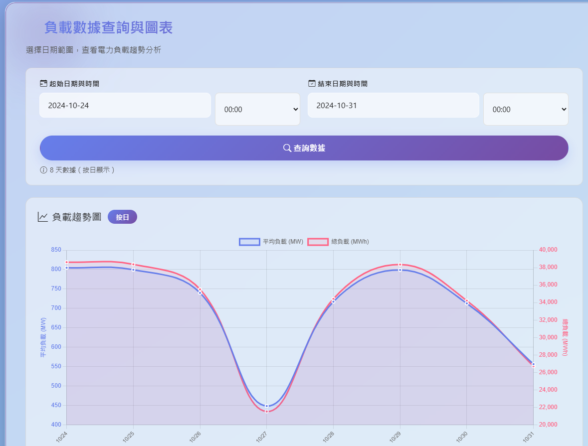
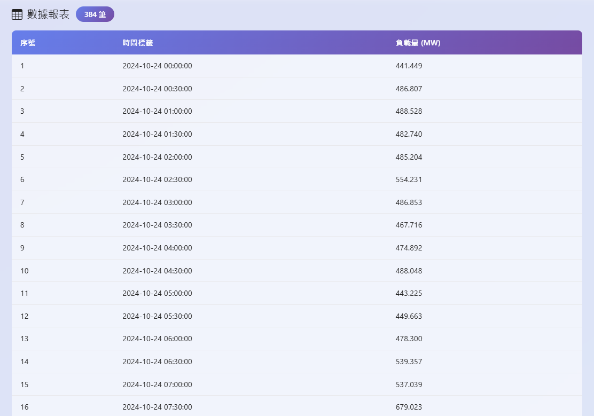

# Electricity Consumption Analysis Application

[](https://github.com/sprigga/ElectricityConsumptionAnalysis/actions/workflows/ci-cd.yml)

## Overview

The Electricity Consumption Analysis Application is a web-based system designed to import, store, analyze and visualize electrical load readings. The application allows users to import electricity consumption data from Excel files, store it in a time-series format, and provides API endpoints for data retrieval and analysis.

## Screenshots




## Purpose

This application is specifically designed for:
- Importing electrical load data from Excel spreadsheets (ElectricityConsumptionDifferenceTable.xlsx format)
- Storing time-series load readings in a database
- Providing API endpoints for load analysis and visualization
- Supporting chart-based data visualization for power consumption trends

## Architecture

### Technology Stack
- **Framework**: ASP.NET Core 8.0
- **Language**: C#
- **Database**: SQLite (default) or SQL Server
- **ORM**: Entity Framework Core
- **Excel Processing**: EPPlus library
- **Frontend**: MVC Views with charting capabilities

### Project Structure

```
ElectricityConsumptionAnalysis/
├── Controllers/           # API and MVC controllers
│   ├── HomeController.cs
│   └── LoadReadingController.cs
├── Data/                 # Database context and migrations
│   ├── ApplicationDbContext.cs
│   ├── Migrations/
│   └── reference/        # Sample Excel files
├── Models/               # Data models
│   ├── LoadReading.cs
│   └── ErrorViewModel.cs
├── Repositories/         # Data access layer
│   ├── ILoadReadingRepository.cs
│   └── LoadReadingRepository.cs
├── Scripts/              # Test and utility scripts
│   ├── test-chart-features.sh    # Chart feature testing script
│   └── test-import-api.sh        # API testing script
├── Services/             # Business logic
│   ├── ILoadReadingImportService.cs
│   └── LoadReadingImportService.cs
├── appsettings.json      # Configuration files
├── Program.cs            # Application startup
├── Dockerfile           # Container deployment
└── ...
```

### Key Components

#### Models
- `LoadReading`: Core entity representing electrical load data with timestamp, load value, and metadata

#### Data Access Layer
- `ApplicationDbContext`: Entity Framework context using SQLite
- `ILoadReadingRepository` / `LoadReadingRepository`: Interface and implementation for database operations

#### Business Logic
- `ILoadReadingImportService` / `LoadReadingImportService`: Handles Excel file parsing and data import with validation

#### API Endpoints
- `GET /api/loadreading` - Retrieve all load readings
- `GET /api/loadreading/range?startDate={yyyy-MM-dd}&endDate={yyyy-MM-dd}` - Get load readings by date range
- `GET /api/loadreading/aggregated?startDate={yyyy-MM-ddTHH:mm:ss}&endDate={yyyy-MM-ddTHH:mm:ss}&days={int}&reportMode={bool}` - Get aggregated data for charts in different modes
- `GET /api/loadreading/count` - Get total record count
- `GET /api/loadreading/daterange` - Get date range of available data
- `POST /api/loadreading/import` - Import from default Excel file
- `POST /api/loadreading/import/custom?filePath={string}&sheetName={string}&dataSource={string}` - Import from custom Excel file
- `POST /api/loadreading/validate?filePath={string}&sheetName={string}` - Validate Excel file format
- `DELETE /api/loadreading/range?startDate={yyyy-MM-dd}&endDate={yyyy-MM-dd}` - Delete records by date range

### API Features

The aggregated endpoint supports different modes of data presentation:
- **Report Mode** (`reportMode=true`): Returns all raw data points at 30-minute intervals
- **Chart Mode** (`reportMode=false`): Returns aggregated data based on time range:
  - 1 day or less: Hourly averages (with date and hour)
  - 7 days or less: Daily averages and totals
  - More than 7 days: Weekly averages and totals

The API also supports custom time ranges with specific hours and minutes, allowing for precise data queries.

#### MVC Views
- `HomeController`: Provides web interface with LoadReadingChart view for visualization

## Features

### Data Import
- Import electrical load data from Excel files in "ElectricityConsumptionDifferenceTable.xlsx" format
- Time-based data parsing with validation
- Support for different Excel sheet names and data sources
- Duplicate detection and handling
- Validation of Excel file format before import
- Support for custom file paths and data sources

### Data Management
- Time-series storage of load readings
- Efficient querying with database indexing
- Date range operations
- Data aggregation for different time periods (hourly, daily, weekly)
- Delete records by date range
- Comprehensive logging throughout the import process

### API Capabilities
- RESTful API endpoints for data access
- Date range filtering
- Aggregated data for charting with different display modes
- Import and validation endpoints
- Support for report mode (30-minute intervals) and chart mode (aggregated data by time periods)
- Query current record count
- Retrieve date range of available data

### Data Visualization
- Interactive chart view for load reading visualization
- Support for different time range selections
- 30-minute interval time selector
- Data aggregation based on selected time range (hourly for 1 day, daily for 7 days, weekly for longer periods)
- Report mode with detailed data listings
- Pagination support for large datasets

### Advanced Features
- Custom time range queries with start and end times
- Support for both average and total values in aggregated data
- Flexible data source management
- Automated database migration on startup
- Comprehensive error handling and logging
- Performance timing for import operations

## Database Schema

The application uses a single table `LoadReadings` with the following structure:

- **Id**: Primary key (integer)
- **Timestamp**: DateTime (with unique constraint)
- **LoadValue**: Decimal (18,3 precision)
- **DataSource**: String (max 100 chars)
- **ImportedAt**: DateTime (defaults to UTC now)
- **Remarks**: String (max 500 chars)

Database indexes are optimized for:
- Unique timestamp constraint
- Timestamp-based queries
- Data source filtering
- Combined timestamp and data source queries

## CI/CD

This project uses a GitHub Actions workflow (`.github/workflows/ci-cd.yml`) for Continuous Integration and Continuous Deployment.

The pipeline includes the following stages:
- **Build and Test**: Compiles the application, runs tests, and publishes the artifact.
- **Build Docker Image**: Builds and pushes a Docker image to GitHub Container Registry.
- **Deploy to Development**: Deploys the application to the development environment on pushes to the `develop` branch.
- **Deploy to Production**: Deploys the application to the production environment on pushes to the `main` branch or on version tags.
- **Security Scan**: Scans the Docker image for vulnerabilities.

## Configuration

### Database
The application supports both SQLite and SQL Server:
- Default: SQLite with "ElectricityConsumptionAnalysis.db" file
- Configurable via "DefaultConnection" connection string

### Excel Import Format
Expected Excel format includes:
- First row: "Time" header followed by dates
- First column: Time values in "HH:mm" format
- Data cells: Load values corresponding to time and date

## Deployment

### Docker Deployment
The application includes a multi-stage Dockerfile:

```Dockerfile
# Uses .NET 8.0 SDK for build
# Multi-stage build process
# .NET 8.0 ASP.NET runtime in final stage
# Exposes ports 80 and 443
# Sets production environment
```

### Environment Variables
- `ASPNETCORE_URLS`: Default is http://+:80
- `ASPNETCORE_ENVIRONMENT`: Default is Production

### Build and Run
```bash
# Build the Docker image
docker build -t electricityconsumptionanalysis .

# Run the container
docker run -p 80:80 electricityconsumptionanalysis
```

## Development

### Prerequisites
- .NET 8.0 SDK
- Visual Studio or Visual Studio Code
- SQLite or SQL Server
- EPPlus library for Excel processing

### Running Locally
```bash
# Clone the repository
git clone <repository-url>

# Navigate to the project directory
cd ElectricityConsumptionAnalysis

# Restore dependencies
dotnet restore

# Run the application
dotnet run
```

### Running with Custom Port
```bash
# Run on a specific port (e.g., 8765)
dotnet run --urls=http://localhost:8765
```

### Development Workflow
1. Clone the repository
2. Install .NET 8.0 SDK
3. Run `dotnet restore` to install dependencies
4. Optionally, modify `appsettings.json` for custom database configuration
5. Run the application with `dotnet run`
6. Access the web interface at the specified URL (default: http://localhost:5000)
7. Use the Load Reading Chart interface for data visualization

### Testing
The project includes comprehensive automated testing with **233+ tests**:
- **Unit Tests:** Service layer, Repository layer, Models (xUnit, Moq, FluentAssertions)
- **Integration Tests:** API endpoints, Database operations
- **Code Coverage:** 80%+ target with Coverlet
- **Manual Tests:** Console-based import testing (TestImport.cs), Bash scripts
- **CI/CD:** Automated test execution with coverage reporting

📚 **See [README_TESTING.md](README_TESTING.md) for complete testing documentation**

#### Quick Start - Running Tests
```bash
# Run all tests
dotnet test

# Run tests with coverage
dotnet test --collect:"XPlat Code Coverage" --settings PowerAnalysis.Tests/coverlet.runsettings

# Run specific test category
dotnet test --filter "FullyQualifiedName~LoadReadingImportServiceTests"
```

#### Test Coverage Breakdown
- Service Layer: 53 tests (Excel import, parsing, validation)
- Repository Layer: 80 tests (CRUD, queries, performance)
- Controller Layer: 60+ tests (All 9 API endpoints)
- Model Layer: 40+ tests (Validation, constraints)

## Test Scripts

Test scripts are located in the `scripts/` directory and provide automated testing for various features:

- `test-import-api.sh` - API testing script for endpoint validation, including import functionality and data verification
- `test-chart-features.sh` - Chart feature testing script with comprehensive functionality tests for visualization endpoints

### Running Test Scripts

```bash
# Run the application first
dotnet run

# In another terminal, execute the API test script
./scripts/test-import-api.sh

# Or execute the chart feature test script
./scripts/test-chart-features.sh
```

### Console Import Testing

For detailed import testing, you can run the TestImport class directly:

```bash
# Run the console import test
dotnet run --project TestImport.cs
```

This will execute a complete import process using the sample Excel file and display detailed results including:
- Import success/failure status
- Number of records imported
- Processing time
- Sample records from the database
- Statistical information about the imported data

## Data Files

- Sample Excel file: `Data/reference/ElectricityConsumptionDifferenceTable.xlsx`
- SQLite database file: `ElectricityConsumptionAnalysis.db`

### Excel File Format

The application expects Excel files in the following format:
- First row: "Time" header followed by date columns
- First column: Time values in "HH:mm" format
- Data cells: Load values corresponding to time and date
- Default sheet name: "負載交叉表" (Load Cross Table)

Example structure:
```
      | 2024-01-01 | 2024-01-02 | 2024-01-03 |
------+------------+------------+------------+
Time  |            |            |            |
00:00 |   100.5    |   102.3    |   98.7     |
00:30 |   98.2     |   101.8    |   99.1     |
01:00 |   95.6     |   99.4     |   100.5    |
...
```

## Security Considerations

- Connection strings can be configured via environment variables
- Input validation for Excel files
- Parameter validation for all API endpoints
- Proper error handling without exposing sensitive information

## Logging

- Comprehensive logging throughout the application
- Structured logging for import operations
- Error logging with context information
- Performance timing for import operations
- Detailed logging for API requests and responses
- Import result logging with success/failure status, record counts, and processing time